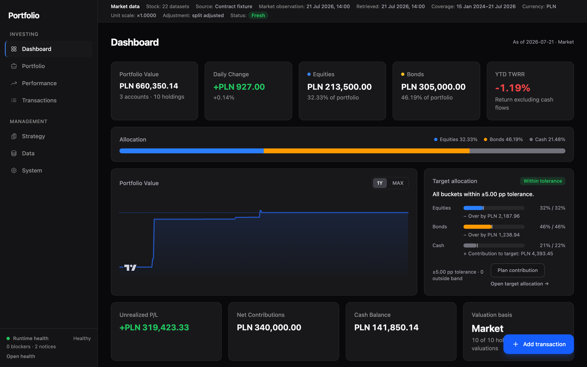
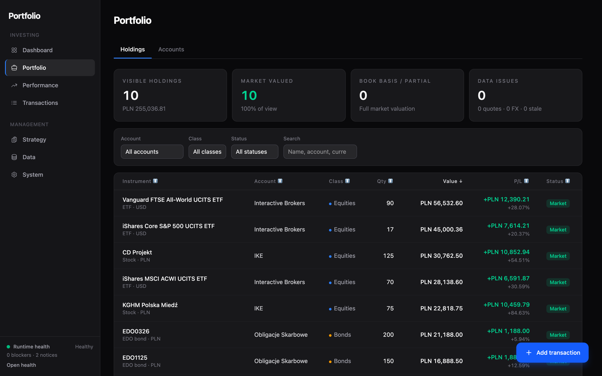
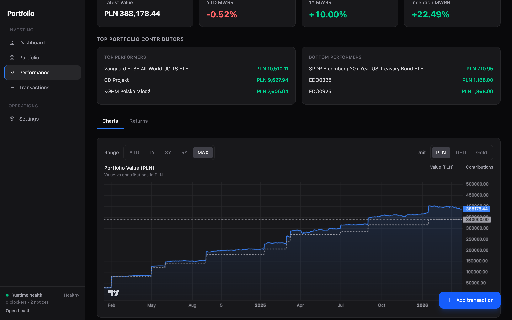
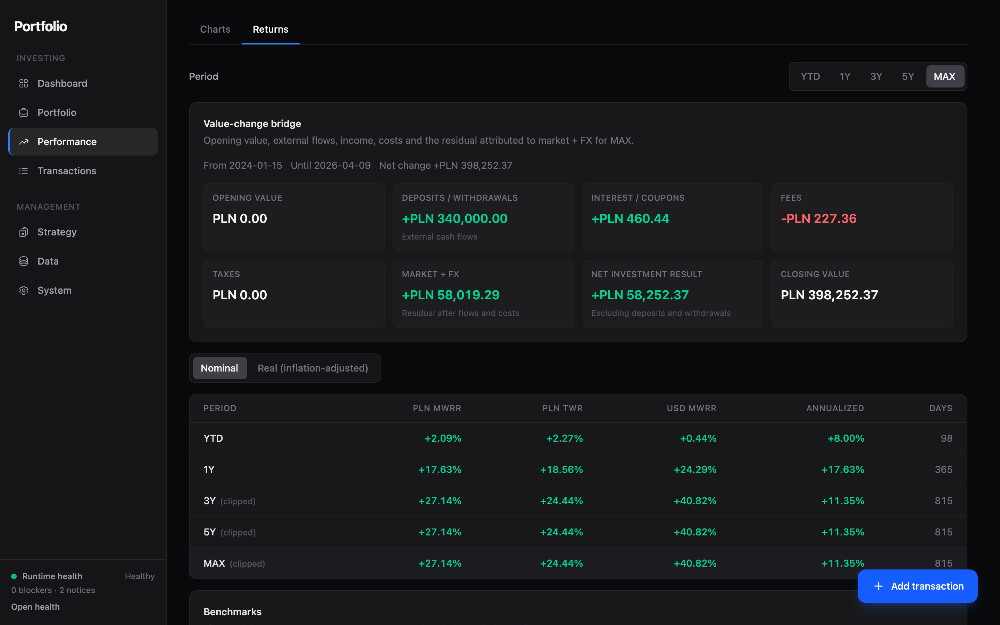
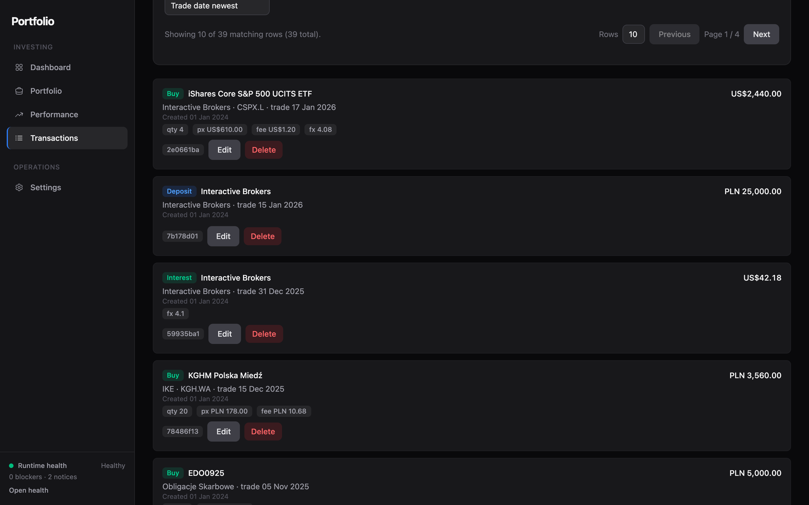

# Portfolio

Portfolio is a self-hosted portfolio tracker for long-term investors.

<a href="docs/screenshots/dashboard.png"></a>

<p>
  <a href="docs/screenshots/portfolio-holdings.png"></a>
  <a href="docs/screenshots/performance.png"></a>
  <a href="docs/screenshots/performance-returns.png"></a>
  <a href="docs/screenshots/transactions.png"></a>
</p>

The product is built around a few explicit rules:

- transactions are the canonical source of truth
- analytical views are rebuildable read models
- SQLite is the runtime database
- JSON export, import, backup, and restore remain first-class
- the product is optimized for a single-user self-hosted setup

## What the product covers

- accounts, instruments, transactions, targets, and reusable CSV import profiles
- holdings, allocation drift, and contribution-first rebalance guidance
- dashboard contribution planner with suggested splits and manual asset-class previews
- daily history and performance in `PLN`, `USD`, and gold
- `MWRR`, `TWR`, real return, and benchmark-relative comparison
- benchmark configuration with shipped defaults, target-mix, and unlimited custom references
- EDO valuation via `edo-calculator`
- ETF, FX, and benchmark history via `stock-analyst`
- fallback market-data snapshots surfaced as `STALE` or degraded coverage instead of pretending freshness
- canonical state export/import with preview diff, warnings, and blocking validation
- server backups, restore workflow, audit trail, and read-model cache diagnostics
- target-history visibility through audit events
- optional single-user password auth
- installable PWA shell for phone and tablet use
- active mobile views refresh on app resume after a longer pause

## Repository layout

```text
portfolio/
├── AGENTS.md
├── docker-compose.yml
├── docker-compose.market-data.remote.yml
├── docker-compose.market-data.self-hosted.yml
├── docker-compose.full-stack.example.yml
├── docs/
├── apps/
│   ├── api/
│   │   └── portfolio-domain/
│   └── web/
└── README.md
```

## Quick start

### 1. Local app stack from this repo

```bash
docker compose --profile app up -d --build
```

This starts:

- `portfolio-api`
- `portfolio-web`
- SQLite on a named Docker volume
- JSON backups on a separate named Docker volume

Endpoints:

- UI: `http://127.0.0.1:4174`
- API: `http://127.0.0.1:18082`

In the default local compose mode:

- live market data is off
- OpenAPI UI is off
- auth is off
- Docker sets `PORTFOLIO_AUTH_SECURE_COOKIE=true`, which is the right default when the app later sits behind HTTPS

### 2. Local app stack with remote market data

```dotenv
PORTFOLIO_STOCK_ANALYST_API_URL=https://your-stock-analyst.example/api
PORTFOLIO_STOCK_ANALYST_UI_URL=https://your-stock-analyst.example
PORTFOLIO_EDO_CALCULATOR_API_URL=https://your-edo-calculator.example
```

```bash
docker compose \
  -f docker-compose.yml \
  -f docker-compose.market-data.remote.yml \
  --profile app up -d --build
```

### 3. Local app stack with self-hosted market-data services

```bash
docker compose \
  -f docker-compose.yml \
  -f docker-compose.market-data.self-hosted.yml \
  --profile app up -d --build
```

This adds:

- `stock-analyst`
- `stock-analyst-backend-yfinance`
- `edo-calculator`

On ARM hosts, the override currently pins upstream market-data services to `linux/amd64`. If those images become multi-arch later, remove or override `PORTFOLIO_MARKET_DATA_PLATFORM`.

### 4. Full self-hosted stack from published images

```bash
cp docker-compose.full-stack.example.yml docker-compose.full-stack.yml
docker compose -f docker-compose.full-stack.yml up -d
```

Use this path when you want a published-image deployment rather than a repo build.

## Runtime model

Portfolio is intentionally `SQLite-only`.

Key invariants:

- one API process per database file
- transactions remain canonical
- history and returns stay rebuildable
- market-data snapshots are resilience data, not source of truth
- backups and exports stay portable JSON

Default application config in `apps/api/src/main/resources/application.yaml` is conservative:

- `marketData.enabled=false`
- `openapi.uiEnabled=false`
- `auth.enabled=false`

Compose overrides decide the real runtime mode. That keeps local raw app startup safe by default and makes market-data behavior explicit instead of accidental.

## State export, preview, import, and restore

Portfolio has two import modes: `MERGE` and `REPLACE`.

### `MERGE`

- accounts, instruments, transactions, and app preferences are upserted by id or key
- if the snapshot omits `targets`, the current target allocation is preserved
- if the snapshot contains `targets`, that section replaces the target allocation as one set
- if the snapshot omits `importProfiles`, current profiles are preserved
- if the snapshot contains `importProfiles`, they merge by id, but final profile names must stay unique

### `REPLACE`

- requires explicit `REPLACE` confirmation
- clears the current write model before loading the snapshot
- creates a safety backup automatically before the destructive step

### Preview behavior

Preview is not a cosmetic dry run. It uses the same validation path as the real import and returns:

- blocking issues
- warnings
- section-by-section diff counts
- skip/preserve semantics for targets and import profiles

If preview says the snapshot is valid, import should not later fail on a hidden business rule that preview skipped.

## Production notes for self-hosting

- keep secrets and upstream URLs in a local `.env`, not in Git
- prefer the example compose file or your own compose wrapper for real deployment
- use `PORTFOLIO_AUTH_SECURE_COOKIE=true` behind HTTPS
- keep `PORTFOLIO_OPENAPI_UI_ENABLED=false` unless you actively need the docs UI
- treat `REPLACE` import or restore as a maintenance action, not a casual workflow

If you want an empty reset:

```bash
docker compose down --volumes --remove-orphans
docker compose up -d
```

## Important environment variables

### Market data

- `PORTFOLIO_MARKET_DATA_ENABLED`
- `PORTFOLIO_STOCK_ANALYST_API_URL`
- `PORTFOLIO_STOCK_ANALYST_UI_URL`
- `PORTFOLIO_EDO_CALCULATOR_API_URL`
- `PORTFOLIO_GOLD_API_URL`
- `PORTFOLIO_GOLD_API_KEY`
- `PORTFOLIO_MARKET_DATA_STALE_AFTER_DAYS`

`PORTFOLIO_STOCK_ANALYST_UI_URL` is optional. Set it only when you want the UI to open an external stock-analyst page for instruments backed by that upstream.

### Backups

- `PORTFOLIO_BACKUPS_ENABLED`
- `PORTFOLIO_BACKUPS_DIRECTORY`
- `PORTFOLIO_BACKUPS_INTERVAL_MINUTES`
- `PORTFOLIO_BACKUPS_RETENTION_COUNT`

### Read-model refresh

- `PORTFOLIO_READ_MODEL_REFRESH_ENABLED`
- `PORTFOLIO_READ_MODEL_REFRESH_INTERVAL_MINUTES`
- `PORTFOLIO_READ_MODEL_REFRESH_RUN_ON_START`

### OpenAPI UI

- `PORTFOLIO_OPENAPI_UI_ENABLED`

### Optional auth

- `PORTFOLIO_AUTH_ENABLED`
- `PORTFOLIO_AUTH_PASSWORD`
- `PORTFOLIO_AUTH_SESSION_SECRET`
- `PORTFOLIO_AUTH_SESSION_COOKIE_NAME`
- `PORTFOLIO_AUTH_SECURE_COOKIE`
- `PORTFOLIO_AUTH_SESSION_MAX_AGE_DAYS`

## Local verification

API:

```bash
cd apps/api
./gradlew test detekt
```

Web:

```bash
cd apps/web
npm run lint
npm test
npm run build
```

## Screenshots

The README screenshots are generated with Playwright against a seeded instance:

```bash
cd apps/web
PORTFOLIO_E2E_BASE_URL=http://127.0.0.1:4174 npx playwright test e2e/screenshots.spec.ts
```

Output lands in `docs/screenshots/`. The script seeds a demo portfolio, captures screens in `en-GB` locale, then restores the original data.

## Docs

- [docs/architecture.md](./docs/architecture.md): system shape, runtime boundaries, verification model
- [docs/domain-model.md](./docs/domain-model.md): canonical entities, derived models, and invariants
- [docs/runbook.md](./docs/runbook.md): deployment, health checks, backup/restore, auth guardrails
- [docs/roadmap.md](./docs/roadmap.md): short active priorities only
